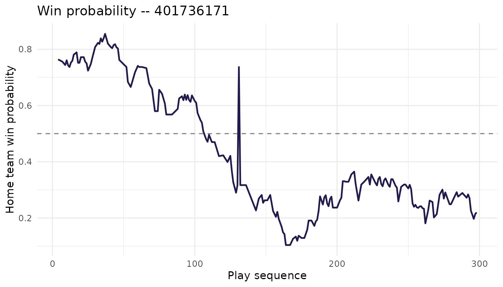

# ESPN basketball endpoints -- WBB & WNBA

## What this vignette covers

If you’ve used `wehoop` before, you’ve probably reached for
[`espn_wbb_pbp()`](https://wehoop.sportsdataverse.org/reference/espn_wbb_pbp.md),
[`espn_wnba_pbp()`](https://wehoop.sportsdataverse.org/reference/espn_wnba_pbp.md),
and the box score wrappers. Those get you the bulk of any analysis built
around individual games. The package now also wraps a much wider slice
of ESPN’s basketball API – team rosters, schedules, league news, athlete
biographies and gamelogs, in-game win probabilities, officials,
broadcast info, the WNBA draft, free agency, transactions, and
league-wide catalogs of venues, coaches, and statistical leaders. Around
180 ESPN endpoint wrappers in total, split between women’s college
basketball (`espn_wbb_*`) and the WNBA (`espn_wnba_*`).

This vignette is a tour of what’s available and how to compose the
pieces. Most of the chunks run live when the package website is built,
so the tables below are real ESPN responses – and every one of them
works the same way when you copy it into an interactive session.

## A note on the API surface

ESPN exposes basketball data through three public, unauthenticated API
hosts, and `wehoop` reaches into each:

- **`site.api.espn.com/apis/site/v2/sports/basketball/{league}`** is the
  most stable. It serves scoreboards, teams, rosters, schedules, news,
  injuries, standings, and player and team season stats.
- **`sports.core.api.espn.com/v2/sports/basketball/{league}`** carries
  the deeper resources: athlete indexes, per-event detail (odds, win
  probabilities, officials, broadcasts), seasons, venues, coaches, the
  WNBA draft, and transactions. Big collections paginate via `$ref`
  links.
- **`site.web.api.espn.com/apis/common/v3/sports/basketball/{league}`**
  carries per-athlete deep detail – season overview, stats by category,
  game-by-game logs, situational splits. It’s the least stable of the
  three; older seasons sometimes return 404, and not every athlete is
  represented.

There’s a fourth host (`cdn.espn.com/core`) that surfaces the same
information as the site-v2 `/summary` endpoint we already parse, so we
don’t wrap it.

The league slugs in URL paths are `womens-college-basketball` and
`wnba`. Those only matter if you’re building requests by hand.

**Rate limits.** ESPN doesn’t publish them. In practice, requests
arriving faster than about one per second occasionally come back as HTTP
429 or as silently empty payloads. If you’re looping over many games or
athletes, drop a `Sys.sleep(1)` between calls.

**Proxies.** ESPN wrappers don’t accept a per-call `proxy =` argument;
they call into the package’s HTTP layer directly. Set the proxy once at
the top of your session with
`options(wehoop.proxy = "http://host:port")` (or a list, for
authenticated proxies) and every ESPN call will pick it up
automatically.

## What’s available, by use case

The tables below are grouped by what you’re likely trying to do.
Function names are clickable on the pkgdown reference.

### Game data

These all key off `game_id` (also called `event_id` in some endpoints –
they’re the same thing).

| Function | Returns |
|----|----|
| [`espn_wbb_game_all()`](https://wehoop.sportsdataverse.org/reference/espn_wbb_game_all.md) / [`espn_wnba_game_all()`](https://wehoop.sportsdataverse.org/reference/espn_wnba_game_all.md) | Full game summary as a named list |
| [`espn_wbb_pbp()`](https://wehoop.sportsdataverse.org/reference/espn_wbb_pbp.md) / [`espn_wnba_pbp()`](https://wehoop.sportsdataverse.org/reference/espn_wnba_pbp.md) | Play-by-play |
| [`espn_wbb_team_box()`](https://wehoop.sportsdataverse.org/reference/espn_wbb_team_box.md) / [`espn_wnba_team_box()`](https://wehoop.sportsdataverse.org/reference/espn_wnba_team_box.md) | Team box score |
| [`espn_wbb_player_box()`](https://wehoop.sportsdataverse.org/reference/espn_wbb_player_box.md) / [`espn_wnba_player_box()`](https://wehoop.sportsdataverse.org/reference/espn_wnba_player_box.md) | Player box score |
| [`espn_wbb_game_rosters()`](https://wehoop.sportsdataverse.org/reference/espn_wbb_game_rosters.md) / [`espn_wnba_game_rosters()`](https://wehoop.sportsdataverse.org/reference/espn_wnba_game_rosters.md) | Game-day rosters |

### Scoreboard, conferences, and league reference

| Function | Returns |
|----|----|
| [`espn_wbb_scoreboard()`](https://wehoop.sportsdataverse.org/reference/espn_wbb_scoreboard.md) / [`espn_wnba_scoreboard()`](https://wehoop.sportsdataverse.org/reference/espn_wnba_scoreboard.md) | Daily scoreboard |
| [`espn_wbb_teams()`](https://wehoop.sportsdataverse.org/reference/espn_wbb_teams.md) / [`espn_wnba_teams()`](https://wehoop.sportsdataverse.org/reference/espn_wnba_teams.md) | All teams |
| [`espn_wbb_conferences()`](https://wehoop.sportsdataverse.org/reference/espn_wbb_conferences.md) / [`espn_wnba_conferences()`](https://wehoop.sportsdataverse.org/reference/espn_wnba_conferences.md) | Conferences |
| [`espn_wbb_rankings()`](https://wehoop.sportsdataverse.org/reference/espn_wbb_rankings.md) | AP / coaches poll (WBB only – WNBA has no poll) |
| [`espn_wbb_standings()`](https://wehoop.sportsdataverse.org/reference/espn_wbb_standings.md) / [`espn_wnba_standings()`](https://wehoop.sportsdataverse.org/reference/espn_wnba_standings.md) | Conference / league standings |
| [`espn_wbb_news()`](https://wehoop.sportsdataverse.org/reference/espn_wbb_news.md) / [`espn_wnba_news()`](https://wehoop.sportsdataverse.org/reference/espn_wnba_news.md) | League-wide news feed |
| [`espn_wbb_calendar()`](https://wehoop.sportsdataverse.org/reference/espn_wbb_calendar.md) / [`espn_wnba_calendar()`](https://wehoop.sportsdataverse.org/reference/espn_wnba_calendar.md) | Season calendar weeks |

### Team detail

| Function | Returns |
|----|----|
| [`espn_wbb_team()`](https://wehoop.sportsdataverse.org/reference/espn_wbb_team.md) / [`espn_wnba_team()`](https://wehoop.sportsdataverse.org/reference/espn_wnba_team.md) | Single-team info, record, coaches |
| [`espn_wbb_team_roster()`](https://wehoop.sportsdataverse.org/reference/espn_wbb_team_roster.md) / [`espn_wnba_team_roster()`](https://wehoop.sportsdataverse.org/reference/espn_wnba_team_roster.md) | Roster |
| [`espn_wbb_team_schedule()`](https://wehoop.sportsdataverse.org/reference/espn_wbb_team_schedule.md) / [`espn_wnba_team_schedule()`](https://wehoop.sportsdataverse.org/reference/espn_wnba_team_schedule.md) | Schedule |
| [`espn_wbb_team_leaders()`](https://wehoop.sportsdataverse.org/reference/espn_wbb_team_leaders.md) / [`espn_wnba_team_leaders()`](https://wehoop.sportsdataverse.org/reference/espn_wnba_team_leaders.md) | Statistical leaders |
| [`espn_wbb_team_news()`](https://wehoop.sportsdataverse.org/reference/espn_wbb_team_news.md) / [`espn_wnba_team_news()`](https://wehoop.sportsdataverse.org/reference/espn_wnba_team_news.md) | Team news feed |
| [`espn_wbb_team_stats()`](https://wehoop.sportsdataverse.org/reference/espn_wbb_team_stats.md) / [`espn_wnba_team_stats()`](https://wehoop.sportsdataverse.org/reference/espn_wnba_team_stats.md) | Team-level season stats |
| [`espn_wbb_team_injuries()`](https://wehoop.sportsdataverse.org/reference/espn_wbb_team_injuries.md) / [`espn_wnba_team_injuries()`](https://wehoop.sportsdataverse.org/reference/espn_wnba_team_injuries.md) | Team injury report |
| [`espn_wbb_injuries()`](https://wehoop.sportsdataverse.org/reference/espn_wbb_injuries.md) / [`espn_wnba_injuries()`](https://wehoop.sportsdataverse.org/reference/espn_wnba_injuries.md) | League-wide injury report |

### Athlete detail

| Function | Returns |
|----|----|
| [`espn_wbb_player_info()`](https://wehoop.sportsdataverse.org/reference/espn_wbb_player_info.md) / [`espn_wnba_player_info()`](https://wehoop.sportsdataverse.org/reference/espn_wnba_player_info.md) | Bio and profile |
| [`espn_wbb_player_overview()`](https://wehoop.sportsdataverse.org/reference/espn_wbb_player_overview.md) / [`espn_wnba_player_overview()`](https://wehoop.sportsdataverse.org/reference/espn_wnba_player_overview.md) | Season overview (web-common-v3) |
| [`espn_wbb_player_stats_v3()`](https://wehoop.sportsdataverse.org/reference/espn_wbb_player_stats_v3.md) / [`espn_wnba_player_stats_v3()`](https://wehoop.sportsdataverse.org/reference/espn_wnba_player_stats_v3.md) | Season stats by category |
| [`espn_wbb_player_gamelog()`](https://wehoop.sportsdataverse.org/reference/espn_wbb_player_gamelog.md) / [`espn_wnba_player_gamelog()`](https://wehoop.sportsdataverse.org/reference/espn_wnba_player_gamelog.md) | Game-by-game log |
| [`espn_wbb_player_splits()`](https://wehoop.sportsdataverse.org/reference/espn_wbb_player_splits.md) / [`espn_wnba_player_splits()`](https://wehoop.sportsdataverse.org/reference/espn_wnba_player_splits.md) | Situational splits |
| [`espn_wbb_player_eventlog()`](https://wehoop.sportsdataverse.org/reference/espn_wbb_player_eventlog.md) / [`espn_wnba_player_eventlog()`](https://wehoop.sportsdataverse.org/reference/espn_wnba_player_eventlog.md) | Event log (`$ref` links) |
| [`espn_wbb_player_awards()`](https://wehoop.sportsdataverse.org/reference/espn_wbb_player_awards.md) / [`espn_wnba_player_awards()`](https://wehoop.sportsdataverse.org/reference/espn_wnba_player_awards.md) | Awards history |
| [`espn_wbb_player_statisticslog()`](https://wehoop.sportsdataverse.org/reference/espn_wbb_player_statisticslog.md) / [`espn_wnba_player_statisticslog()`](https://wehoop.sportsdataverse.org/reference/espn_wnba_player_statisticslog.md) | Stats log (core-v2) |
| [`espn_wbb_player_stats()`](https://wehoop.sportsdataverse.org/reference/espn_wbb_player_stats.md) / [`espn_wnba_player_stats()`](https://wehoop.sportsdataverse.org/reference/espn_wnba_player_stats.md) | Cross-athlete season stats |

### Per-event enrichment

These take an `event_id` and complement the play-by-play.

| Function | Returns |
|----|----|
| [`espn_wbb_game_odds()`](https://wehoop.sportsdataverse.org/reference/espn_wbb_game_odds.md) / [`espn_wnba_game_odds()`](https://wehoop.sportsdataverse.org/reference/espn_wnba_game_odds.md) | Opening / closing lines (WNBA only – empty for WBB) |
| [`espn_wbb_game_probabilities()`](https://wehoop.sportsdataverse.org/reference/espn_wbb_game_probabilities.md) / [`espn_wnba_game_probabilities()`](https://wehoop.sportsdataverse.org/reference/espn_wnba_game_probabilities.md) | Win probability per play |
| [`espn_wbb_game_officials()`](https://wehoop.sportsdataverse.org/reference/espn_wbb_game_officials.md) / [`espn_wnba_game_officials()`](https://wehoop.sportsdataverse.org/reference/espn_wnba_game_officials.md) | Officials |
| [`espn_wbb_game_broadcasts()`](https://wehoop.sportsdataverse.org/reference/espn_wbb_game_broadcasts.md) / [`espn_wnba_game_broadcasts()`](https://wehoop.sportsdataverse.org/reference/espn_wnba_game_broadcasts.md) | Broadcast outlets |

### League-wide catalogs

| Function | Returns |
|----|----|
| [`espn_wbb_leaders()`](https://wehoop.sportsdataverse.org/reference/espn_wbb_leaders.md) / [`espn_wnba_leaders()`](https://wehoop.sportsdataverse.org/reference/espn_wnba_leaders.md) | League statistical leaders |
| [`espn_wbb_venues()`](https://wehoop.sportsdataverse.org/reference/espn_wbb_venues.md) / [`espn_wnba_venues()`](https://wehoop.sportsdataverse.org/reference/espn_wnba_venues.md) | Arenas |
| [`espn_wbb_coaches()`](https://wehoop.sportsdataverse.org/reference/espn_wbb_coaches.md) / [`espn_wnba_coaches()`](https://wehoop.sportsdataverse.org/reference/espn_wnba_coaches.md) | Coaches |
| [`espn_wbb_athletes_index()`](https://wehoop.sportsdataverse.org/reference/espn_wbb_athletes_index.md) / [`espn_wnba_athletes_index()`](https://wehoop.sportsdataverse.org/reference/espn_wnba_athletes_index.md) | Full athlete index |
| [`espn_wbb_seasons()`](https://wehoop.sportsdataverse.org/reference/espn_wbb_seasons.md) / [`espn_wnba_seasons()`](https://wehoop.sportsdataverse.org/reference/espn_wnba_seasons.md) | Seasons on record |
| [`espn_wbb_season_info()`](https://wehoop.sportsdataverse.org/reference/espn_wbb_season_info.md) / [`espn_wnba_season_info()`](https://wehoop.sportsdataverse.org/reference/espn_wnba_season_info.md) | Single-season metadata |

### WNBA-only

The pro-league side has draft, free agency, and transaction logs that
don’t have NCAA equivalents.

| Function | Returns |
|----|----|
| [`espn_wnba_draft()`](https://wehoop.sportsdataverse.org/reference/espn_wnba_draft.md) | Draft picks by season |
| [`espn_wnba_freeagents()`](https://wehoop.sportsdataverse.org/reference/espn_wnba_freeagents.md) | Free agents (during the FA window) |
| [`espn_wnba_transactions()`](https://wehoop.sportsdataverse.org/reference/espn_wnba_transactions.md) | Transactions log |

## Worked examples

The examples below use UConn (`team_id = 2509`) for WBB and the Las
Vegas Aces (`team_id = 17`) for the WNBA. Most ESPN team IDs and athlete
IDs are easy to discover with
[`espn_wbb_teams()`](https://wehoop.sportsdataverse.org/reference/espn_wbb_teams.md)
/
[`espn_wnba_teams()`](https://wehoop.sportsdataverse.org/reference/espn_wnba_teams.md)
and the various roster endpoints.

### Browsing news and the season calendar

When you’re starting a new analysis, the easiest way to confirm the
season is active and you’re hitting current data is to pull the news
feed and the calendar.

``` r

library(wehoop)

# Latest 10 WBB news items
wbb_news <- espn_wbb_news(limit = 10)
head(wbb_news[, c("headline", "published")])
#> # A tibble: 6 × 2
#>   headline                                                             published
#>   <chr>                                                                <chr>    
#> 1 College basketball eligibility: What to know about latest rulings    2026-08-…
#> 2 Court halts order, denies extra year of eligibility                  2026-08-…
#> 3 Greg Sankey, in filing, speaks out against pros returning to NCAA    2026-08-…
#> 4 NCAA lands new deal to promote championship events                   2026-08-…
#> 5 Women's college basketball recruiting: Top 25 players regardless of… 2026-08-…
#> 6 Notable Walk-Offs: Reflect on historic moments across the SEC        2026-08-…

# 2025 WBB season calendar
wbb_cal <- espn_wbb_calendar(season = 2025)
head(wbb_cal)
#> # A tibble: 6 × 12
#>   season season_type season_type_label season_start_date season_end_date  
#>   <chr>  <chr>       <chr>             <chr>             <chr>            
#> 1 2025   NA          NA                2024-07-13T07:00Z 2025-04-09T06:59Z
#> 2 2025   NA          NA                2024-07-13T07:00Z 2025-04-09T06:59Z
#> 3 2025   NA          NA                2024-07-13T07:00Z 2025-04-09T06:59Z
#> 4 2025   NA          NA                2024-07-13T07:00Z 2025-04-09T06:59Z
#> 5 2025   NA          NA                2024-07-13T07:00Z 2025-04-09T06:59Z
#> 6 2025   NA          NA                2024-07-13T07:00Z 2025-04-09T06:59Z
#> # ℹ 7 more variables: calendar_type <chr>, label <chr>, alternate_label <chr>,
#> #   detail <chr>, value <chr>, start_date <chr>, end_date <chr>

# Same on the WNBA side
wnba_news <- espn_wnba_news(limit = 10)
wnba_cal  <- espn_wnba_calendar(season = 2025)
```

The calendar tibble carries one row per scheduling block (preseason,
regular season, postseason, championship weeks, etc.), with start and
end dates. It’s useful for filtering schedules and scoreboards down to a
specific portion of the year.

### Looking at a team

[`espn_wbb_team()`](https://wehoop.sportsdataverse.org/reference/espn_wbb_team.md)
and
[`espn_wnba_team()`](https://wehoop.sportsdataverse.org/reference/espn_wnba_team.md)
return a small named list with high-level identity, record, next event,
and coaching info. Pair it with the roster, schedule, and team-leader
wrappers when you want a fuller picture.

``` r

# UConn at a glance
uconn <- espn_wbb_team(team_id = 2509, season = 2025)
names(uconn)        # Info, Record, NextEvent, StandingSummary, Coaches
#> [1] "Info"            "Record"          "NextEvent"       "StandingSummary"
#> [5] "Coaches"

# Current roster
uconn_roster <- espn_wbb_team_roster(team_id = 2509, season = 2025)
head(uconn_roster[, c("athlete_display_name", "position_name", "jersey")])
#> Error in `uconn_roster[, c("athlete_display_name", "position_name", "jersey")]`:
#> ! Can't subset columns that don't exist.
#> ✖ Column `athlete_display_name` doesn't exist.

# Regular-season schedule
uconn_sched <- espn_wbb_team_schedule(
  team_id = 2509, season = 2025, season_type = 2
)
head(uconn_sched[, c("name", "date", "home_away", "score")])
#> Error in `uconn_sched[, c("name", "date", "home_away", "score")]`:
#> ! Can't subset columns that don't exist.
#> ✖ Column `score` doesn't exist.

# Statistical leaders for the team
uconn_ldrs <- espn_wbb_team_leaders(team_id = 2509, season = 2025)
head(uconn_ldrs)
#> # A tibble: 0 × 0
```

The same shape applies to WNBA teams – `espn_wnba_team(17, 2025)` for
the Aces, plus `_team_roster()`, `_team_schedule()`, and so on.

A small caveat on the roster and leaders endpoints: ESPN serves only the
*current* roster and leaders for each team, regardless of any `season`
you pass. The argument is preserved in the function signature for API
symmetry, but it doesn’t change the request URL.

### Tracking injuries

Injury data is a soft spot in ESPN’s WBB coverage – most college games
don’t carry an active injury report. WNBA injuries are more reliably
populated when the league is in season.

``` r

# Whole league
wnba_inj <- espn_wnba_injuries(season = 2025)

# Single team
aces_inj <- espn_wnba_team_injuries(team_id = 17)

# WBB injuries are sparse on ESPN -- an empty tibble is the normal case
wbb_inj <- espn_wbb_injuries(season = 2025)
```

If you’re building a workflow that depends on injury data, gate
downstream code on `nrow(...) > 0`.

### Following an athlete

The athlete endpoints are the deepest part of the surface. Pull a
roster, pick a player, and you have biographical data, season-level
totals, a per-game log, situational splits, and an awards history all
keyed off the same `athlete_id`.

``` r

library(dplyr)

uconn_roster <- espn_wbb_team_roster(team_id = 2509, season = 2025)

athlete_id   <- uconn_roster$athlete_id[1]
athlete_name <- uconn_roster$athlete_display_name[1]
message("Selected: ", athlete_name, " (", athlete_id, ")")

# Bio and profile
bio <- espn_wbb_player_info(athlete_id = athlete_id)
glimpse(bio)
#> List of 6
#>  $ Bio     : wehop_dt [1 × 16] (S3: wehoop_data/tbl_df/tbl/data.table/data.frame)
#>   ..$ id            : chr "5311737"
#>   ..$ uid           : chr "s:40~l:54~a:5311737"
#>   ..$ guid          : chr "e082d6da-e8f8-32d8-8085-45ea3bfc5eac"
#>   ..$ first_name    : chr "Carley"
#>   ..$ last_name     : chr "Barrett"
#>   ..$ full_name     : chr "Carley Barrett"
#>   ..$ display_name  : chr "Carley Barrett"
#>   ..$ short_name    : chr "C. Barrett"
#>   ..$ height        : num 67
#>   ..$ display_height: chr "5' 7\""
#>   ..$ jersey        : chr "24"
#>   ..$ active        : logi TRUE
#>   ..$ headshot_href : chr "https://a.espncdn.com/i/headshots/womens-college-basketball/players/full/5311737.png"
#>   ..$ birth_city    : chr "Lafayette"
#>   ..$ birth_state   : chr "IN"
#>   ..$ birth_country : chr "USA"
#>   ..- attr(*, "wehoop_timestamp")= POSIXct[1:1], format: "2026-08-24 07:38:18"
#>   ..- attr(*, "wehoop_type")= chr "ESPN WOMENS-COLLEGE-BASKETBALL Athlete Bio from ESPN.com"
#>  $ Team    : wehop_dt [1 × 1] (S3: wehoop_data/tbl_df/tbl/data.table/data.frame)
#>   ..$ x_ref: chr "http://sports.core.api.espn.com/v2/sports/basketball/leagues/womens-college-basketball/seasons/2027/teams/2509?"| __truncated__
#>   ..- attr(*, "wehoop_timestamp")= POSIXct[1:1], format: "2026-08-24 07:38:18"
#>   ..- attr(*, "wehoop_type")= chr "ESPN WOMENS-COLLEGE-BASKETBALL Athlete Team from ESPN.com"
#>  $ Position: wehop_dt [1 × 5] (S3: wehoop_data/tbl_df/tbl/data.table/data.frame)
#>   ..$ id          : chr "3"
#>   ..$ name        : chr "Guard"
#>   ..$ display_name: chr "Guard"
#>   ..$ abbreviation: chr "G"
#>   ..$ leaf        : logi FALSE
#>   ..- attr(*, "wehoop_timestamp")= POSIXct[1:1], format: "2026-08-24 07:38:18"
#>   ..- attr(*, "wehoop_type")= chr "ESPN WOMENS-COLLEGE-BASKETBALL Athlete Position from ESPN.com"
#>  $ Status  : wehop_dt [1 × 4] (S3: wehoop_data/tbl_df/tbl/data.table/data.frame)
#>   ..$ id          : chr "1"
#>   ..$ name        : chr "Active"
#>   ..$ type        : chr "active"
#>   ..$ abbreviation: chr "Active"
#>   ..- attr(*, "wehoop_timestamp")= POSIXct[1:1], format: "2026-08-24 07:38:18"
#>   ..- attr(*, "wehoop_type")= chr "ESPN WOMENS-COLLEGE-BASKETBALL Athlete Status from ESPN.com"
#>  $ College : wehop_dt [0 × 0] (S3: wehoop_data/tbl_df/tbl/data.table/data.frame)
#>  Named list()
#>   ..- attr(*, "wehoop_timestamp")= POSIXct[1:1], format: "2026-08-24 07:38:18"
#>   ..- attr(*, "wehoop_type")= chr "ESPN WOMENS-COLLEGE-BASKETBALL Athlete College from ESPN.com"
#>  $ Draft   : wehop_dt [0 × 0] (S3: wehoop_data/tbl_df/tbl/data.table/data.frame)
#>  Named list()
#>   ..- attr(*, "wehoop_timestamp")= POSIXct[1:1], format: "2026-08-24 07:38:18"
#>   ..- attr(*, "wehoop_type")= chr "ESPN WOMENS-COLLEGE-BASKETBALL Athlete Draft from ESPN.com"

# Season overview (web-common-v3)
overview <- espn_wbb_player_overview(
  athlete_id = athlete_id, season = 2025
)
names(overview)
#> [1] "Statistics"     "NextGame"       "Last5Games"     "Headlines"     
#> [5] "FantasyOutlook"

# Game-by-game log
gamelog <- espn_wbb_player_gamelog(
  athlete_id = athlete_id, season = 2025
)
head(gamelog[, c("game_date", "opponent", "points", "rebounds", "assists")])
#> Error in `gamelog[, c("game_date", "opponent", "points", "rebounds", "assists")]`:
#> ! Can't subset columns that don't exist.
#> ✖ Columns `game_date`, `opponent`, `points`, `rebounds`, and `assists` don't exist.

# Situational splits (home/away, by month, vs ranked, ...)
splits <- espn_wbb_player_splits(
  athlete_id = athlete_id, season = 2025
)
head(splits)
#> # A tibble: 1 × 4
#>   athlete_id season name  display_name
#>   <chr>       <dbl> <chr> <chr>       
#> 1 5311737      2025 split split
```

Everything above works the same on the WNBA side – swap `espn_wbb_*` for
`espn_wnba_*` and use a WNBA `athlete_id` (A’ja Wilson is `"3149391"`).

A few things to know about the athlete endpoints:

- `espn_*_athlete_eventlog()` returns `$ref` URL columns rather than
  parsed game stats. Reach for `espn_*_athlete_gamelog()` if you want
  per-game numbers in tibble form.
- `espn_*_athlete_awards()` is sparse. Many athletes have no
  ESPN-recorded awards, so an empty tibble is normal.
- The web-common-v3 endpoints (`_athlete_overview`, `_athlete_stats`,
  `_athlete_gamelog`, `_athlete_splits`) are less stable than the rest
  of the surface. Some seasons before roughly 2018 return HTTP 404, and
  not every athlete is in the index.

### Charting win probability

The combination of `_pbp()` and `_event_probabilities()` is the quickest
way to chart a game’s momentum. Event `'401736171'` below is a 2024 WNBA
regular-season game.

``` r

library(wehoop)
library(dplyr)
library(ggplot2)

game_id <- "401736171"

pbp   <- espn_wnba_pbp(game_id = game_id)
probs <- espn_wnba_game_probabilities(event_id = game_id, limit = 200)

plot_data <- probs %>%
  mutate(seq = as.integer(sequence_number)) %>%
  arrange(seq)

ggplot(plot_data, aes(x = seq, y = as.numeric(home_win_percentage))) +
  geom_line(color = "#221A4D", linewidth = 0.8) +
  geom_hline(yintercept = 0.5, linetype = "dashed", color = "grey50") +
  labs(
    title = paste("Win probability --", game_id),
    x = "Play sequence",
    y = "Home team win probability"
  ) +
  theme_minimal()
```



You can layer in scoring plays from `pbp` to label momentum swings, or
join `_event_officials()` and `_event_broadcasts()` if you want
contextual annotations.

``` r

# Pre-game odds (populated when ESPN carries lines)
odds <- espn_wnba_game_odds(event_id = game_id)

# Officials
officials <- espn_wnba_game_officials(event_id = game_id)
officials[, c("full_name", "position")]
#> Error in `officials[, c("full_name", "position")]`:
#> ! Can't subset columns that don't exist.
#> ✖ Column `position` doesn't exist.

# Broadcast outlets
broadcasts <- espn_wnba_game_broadcasts(event_id = game_id)
broadcasts[, c("market", "names")]
#> Error in `broadcasts[, c("market", "names")]`:
#> ! Can't subset columns that don't exist.
#> ✖ Column `market` doesn't exist.
```

ESPN doesn’t carry betting lines for NCAA games, so
[`espn_wbb_game_odds()`](https://wehoop.sportsdataverse.org/reference/espn_wbb_game_odds.md)
always returns an empty tibble. The function exists for API symmetry;
it’s not a bug. Win probabilities, officials, and broadcasts are all
populated for both leagues.

### Working with the WNBA draft and transactions

The draft, free agency, and transaction logs only exist on the WNBA side
– the NCAA doesn’t have a pro-style draft on ESPN, and the transfer
portal isn’t part of ESPN’s basketball API.

``` r

# 2025 WNBA draft picks
draft_2025 <- espn_wnba_draft(season = 2025)
head(draft_2025[, c("pick", "round", "team_name", "athlete_display_name")])
#> Error in `draft_2025[, c("pick", "round", "team_name", "athlete_display_name")]`:
#> ! Can't subset columns that don't exist.
#> ✖ Columns `team_name` and `athlete_display_name` don't exist.

# Recent transactions (waivers, trades, signings)
txn <- espn_wnba_transactions(season = 2025, limit = 100)
head(txn[, c("date", "type", "athlete_display_name", "team_name")])
#> Error in `txn[, c("date", "type", "athlete_display_name", "team_name")]`:
#> ! Can't subset columns that don't exist.
#> ✖ Columns `athlete_display_name` and `team_name` don't exist.

# Free agents -- empty outside the FA window, which is roughly
# January through April each year
fa <- espn_wnba_freeagents(season = 2025)
nrow(fa)
#> [1] 0
```

If you’re stitching together a roster history, the natural sequence is
draft -\> free agents -\> transactions, joined on `athlete_id`.

### Browsing league-wide catalogs

Sometimes you don’t have a specific team or athlete in mind – you want
the league-wide leaderboard, every venue, every coach, or the full
athlete index. The catalog endpoints cover that.

``` r

# Statistical leaders (points, rebounds, assists, ...)
wnba_ldrs <- espn_wnba_leaders(season = 2024, season_type = 2)
head(wnba_ldrs)
#> # A tibble: 6 × 11
#>   season season_type category      abbreviation athlete_id athlete_name team_id
#>    <int>       <int> <chr>         <chr>        <chr>      <chr>        <chr>  
#> 1   2024           2 pointsPerGame PTS          3149391    NA           17     
#> 2   2024           2 pointsPerGame PTS          3904577    NA           3      
#> 3   2024           2 pointsPerGame PTS          2998938    NA           11     
#> 4   2024           2 pointsPerGame PTS          2998928    NA           9      
#> 5   2024           2 pointsPerGame PTS          3917450    NA           8      
#> 6   2024           2 pointsPerGame PTS          2987869    NA           17     
#> # ℹ 4 more variables: team_abbrev <chr>, value <dbl>, rank <int>,
#> #   display_value <chr>

# Every WNBA arena ESPN tracks
wnba_venues <- espn_wnba_venues()
head(wnba_venues[, c("full_name", "city", "state", "capacity")])
#> Error in `wnba_venues[, c("full_name", "city", "state", "capacity")]`:
#> ! Can't subset columns that don't exist.
#> ✖ Columns `city` and `state` don't exist.

# Coaches (current season)
wbb_coaches <- espn_wbb_coaches(season = 2025)
head(wbb_coaches[, c("full_name", "team_name", "experience")])
#> Error in `wbb_coaches[, c("full_name", "team_name", "experience")]`:
#> ! Can't subset columns that don't exist.
#> ✖ Column `team_name` doesn't exist.
```

The athlete index is the largest of the catalog endpoints – expect
6,000+ rows for a recent WBB season. Pagination is handled internally,
but for exploratory pulls you’ll usually want a small `limit`.

``` r

# WNBA -- a couple hundred active players
wnba_athletes <- espn_wnba_athletes_index(
  season = 2025, active = TRUE, limit = 5000
)
nrow(wnba_athletes)
#> [1] 211
head(wnba_athletes[, c("display_name", "position_name", "team_name")])
#> Error in `wnba_athletes[, c("display_name", "position_name", "team_name")]`:
#> ! Can't subset columns that don't exist.
#> ✖ Columns `display_name`, `position_name`, and `team_name` don't exist.

# WBB -- cap at 50 rows just to peek; the default limit is 25,000
wbb_athletes <- espn_wbb_athletes_index(season = 2025, limit = 50)
head(wbb_athletes[, c("display_name", "position_name", "team_name")])
#> Error in `wbb_athletes[, c("display_name", "position_name", "team_name")]`:
#> ! Can't subset columns that don't exist.
#> ✖ Columns `display_name`, `position_name`, and `team_name` don't exist.
```

The seasons catalog is mostly handy when you want to know which years
ESPN has on record before you start a multi-season pull.

``` r

wnba_seasons <- espn_wnba_seasons()
head(wnba_seasons[, c("year", "start_date", "end_date")])
#> Error in `wnba_seasons[, c("year", "start_date", "end_date")]`:
#> ! Can't subset columns that don't exist.
#> ✖ Column `year` doesn't exist.

# Single-season metadata is mostly $ref URLs to sub-resources, so
# espn_*_seasons() is usually the more useful starting point
wnba_s2025 <- espn_wnba_season_info(season = 2025)
```

## Core-v2 deep expansion

The post-3.0.0 release adds another ~62 ESPN core-v2 wrappers to
`espn_wnba_*` + `espn_wbb_*`, bringing the total ESPN basketball surface
in `wehoop` to **180 functions**. Everything here is shimmed over an
internal `.espn_basketball_*` helper so WNBA and WBB share parsing logic
and bug fixes propagate to both leagues at once.

### Function overview

| Tier | Family | WNBA | WBB | What it gives you |
|----|----|----|----|----|
| 1 / 2A | `athlete_career_stats` | ✓ | ✓ | Long-format career stats (1 row per stat). Default fetches RS + post and binds. |
| 1 / 2A | `athlete_seasons` | ✓ | ✓ | Index of seasons an athlete played, with `$ref`s to season-scoped detail |
| 1 / 2A | `franchises` / `franchise` | ✓ | ✓ | League franchise index + per-franchise detail (stable across relocations) |
| 1 / 2A | `futures` | ✓ | — | Per-season betting futures markets in long format |
| 1 / 2A | `tournaments` / `tournament` / `tournament_seasons` | — | ✓ | NCAA tournament index + per-tournament detail + per-season list |
| 1 / 2A | `team_record` / `team_odds_records` | — | — | (NBA/MBB only) |
| 1 / 2A | `team_season_profile` / `team_season_roster` | ✓ | ✓ | Per-(team × season) profile and roster |
| 1 / 2A | `coach` / `coach_season` | — / ✓ | ✓ / ✓ | Coach detail; coach-in-a-season |
| 1 / 2A | `powerindex` | ✓ | ✓ | Per-season power-index entries per team |
| 1 / 2A | `season_info` / `season_type` / `season_types` | ✓ | ✓ | Season metadata (top-level + per-season-type) |
| 1 / 2A | `season_leaders` | ✓ | ✓ | Per-(season × season-type) leader board, long format. Defaults fetch RS + post. |
| 1 / 2A | `season_rankings` / `season_ranking` | ✓ | ✓ | Per-season poll/ranking indexes |
| 1 / 2A | `season_weeks` / `season_week` | ✓ | ✓ | Weeks within a season (week-based leagues) |
| 1 / 2A | `week_rankings` / `week_ranking` | ✓ | ✓ | Per-week ranking lookups |
| 1 / 2A | `season_groups` / `season_group` / `season_group_children` / `season_group_teams` | ✓ | ✓ | Conferences / divisions / D-I groups within a season |
| 1 / 2A | `season_awards` / `award` | ✓ | ✓ | Per-season awards index + per-award detail |
| 1 / 2A | `draft_pick` | ✓ | — | Single pick lookup |
| 2B.1 | `athlete_eventlog_v2` | ✓ | ✓ | Per-(athlete × season) event log (core-v2; richer than the web-common-v3 variant) |
| 2B.1 | `draft_rounds` / `draft_athletes` / `draft_status` | ✓ | — | Draft year completion: rounds, draftees, in-progress status |
| 2B.2 | `event_situation` | ✓ | ✓ | Live game situation: timeouts, fouls, bonus state, last play `$ref` |
| 2B.2 | `event_predictor` | ✓ | ✓ | Pre-game predictor stats (one row per team × stat) |
| 2B.2 | `event_powerindex` | ✓ | ✓ | Per-event power-index index. Sparse coverage. |
| 2B.2 | `event_propbets` | ✓ | ✓ | Per-(event × provider) prop-bet markets in long format |
| 2B.3 | `event_competitor_linescores` | ✓ | ✓ | Per-quarter scoring for one team in one event |
| 2B.3 | `event_competitor_leaders` | ✓ | ✓ | Top performers per team in long format |
| 2B.3 | `event_competitor_roster` | ✓ | ✓ | Game-day roster index — athlete ids + `$ref`s |
| 2B.3 | `event_competitor_statistics` | ✓ | ✓ | Full team-game statistics in long format |
| 2B.3 | `event_competitor_records` | ✓ | ✓ | Team records as of the event (overall / home / away / conf / div) |
| 2D | `positions` / `position` | ✓ | ✓ | Position dictionary index + detail (id-by-league, **not** shared) |
| 2E.1 | `event_player_box` | ✓ | ✓ | **Per-game player box score**, long format |
| 2E.1 | `event_competitor_roster_entry` | ✓ | ✓ | Single roster row: starter / DNP / ejection / sub slot |
| 2E.1 | `event_play` | ✓ | ✓ | Single-play detail (sequence, period, clock, scoring flags, coords) |
| 2E.1 | `event_play_personnel` | ✓ | ✓ | Players on court at a specific play. Sparse coverage. |
| 2E.2 | `event_competitor_score` | ✓ | ✓ | Single-row final score (value, displayValue, winner, source) |
| 2E.2 | `team_season_statistics` | ✓ | ✓ | Full team-season stat sheet in long format, with league rank per stat |
| 2E.2 | `season_draft` | ✓ | — | Draft-year top-level metadata |
| 2F | `event_official_detail` | ✓ | ✓ | Per-official detail. URL uses crew `order` (1-indexed), not the ESPN stable id. |
| 2F | `team_record_detail` | ✓ | ✓ | Per-record stat array in long format |
| 2F | `coach_record` | — | ✓ | Coach career record by type (Total / Pre Season / Regular Season / Post Season) |
| 2F | `tournament_season` | — | ✓ | Single tournament-year detail |
| 2F | `draft_athlete_detail` | ✓ | — | Rich single-row drafted-player record |

Dashes mark families that don’t apply at ESPN for that league (no WNBA
tournament structure; no WBB futures market; no WNBA coach detail
endpoint; no WBB league-wide draft).

### Athlete career, contracts, splits, and event log

Beyond the gamelog and per-season stats wrappers we shipped in the
initial ESPN batch, the core-v2 surface adds career-level rollups,
season-by-season indexes, and a richer event log.

``` r

library(wehoop)

# Career stats — long format, one row per (stat_type x category x stat).
# Default `stat_type = c(0L, 1L)` fetches regular season + postseason and
# binds them so a single call gives you the player's full career sheet.
caitlin_career <- espn_wbb_player_career_stats(athlete_id = 4433404)
aja_career     <- espn_wnba_player_career_stats(athlete_id = 3149391)

# Per-(athlete x season) event log -- core-v2 variant. Returns
# event_id + result + per-event stats in long format.
espn_wnba_player_eventlog_v2(athlete_id = 3149391, season = 2024)
#> # A tibble: 25 × 8
#>    league athlete_id season event_id  team_id played event_ref   competition_ref
#>    <chr>  <chr>       <int> <chr>     <chr>   <lgl>  <chr>       <chr>          
#>  1 wnba   3149391      2024 401620220 17      TRUE   http://spo… http://sports.…
#>  2 wnba   3149391      2024 401620228 17      TRUE   http://spo… http://sports.…
#>  3 wnba   3149391      2024 401620235 17      TRUE   http://spo… http://sports.…
#>  4 wnba   3149391      2024 401620244 17      TRUE   http://spo… http://sports.…
#>  5 wnba   3149391      2024 401620254 17      TRUE   http://spo… http://sports.…
#>  6 wnba   3149391      2024 401620257 17      TRUE   http://spo… http://sports.…
#>  7 wnba   3149391      2024 401620269 17      TRUE   http://spo… http://sports.…
#>  8 wnba   3149391      2024 401620274 17      TRUE   http://spo… http://sports.…
#>  9 wnba   3149391      2024 401620282 17      TRUE   http://spo… http://sports.…
#> 10 wnba   3149391      2024 401620285 17      TRUE   http://spo… http://sports.…
#> # ℹ 15 more rows

# Index of seasons an athlete has on file (good for iterating).
espn_wnba_player_seasons(athlete_id = 3149391)
#> # A tibble: 9 × 4
#>   league athlete_id season ref                                                  
#>   <chr>  <chr>       <int> <chr>                                                
#> 1 wnba   3149391      2026 http://sports.core.api.espn.com/v2/sports/basketball…
#> 2 wnba   3149391      2025 http://sports.core.api.espn.com/v2/sports/basketball…
#> 3 wnba   3149391      2024 http://sports.core.api.espn.com/v2/sports/basketball…
#> 4 wnba   3149391      2023 http://sports.core.api.espn.com/v2/sports/basketball…
#> 5 wnba   3149391      2022 http://sports.core.api.espn.com/v2/sports/basketball…
#> 6 wnba   3149391      2021 http://sports.core.api.espn.com/v2/sports/basketball…
#> 7 wnba   3149391      2020 http://sports.core.api.espn.com/v2/sports/basketball…
#> 8 wnba   3149391      2019 http://sports.core.api.espn.com/v2/sports/basketball…
#> 9 wnba   3149391      2018 http://sports.core.api.espn.com/v2/sports/basketball…
```

### Franchises, tournaments, and league dictionaries

``` r

# Franchise records are stable across relocations and rebrands.
espn_wnba_franchises()
#> # A tibble: 17 × 3
#>    franchise_id ref                                                       league
#>    <chr>        <chr>                                                     <chr> 
#>  1 3            http://sports.core.api.espn.com/v2/sports/basketball/lea… wnba  
#>  2 5            http://sports.core.api.espn.com/v2/sports/basketball/lea… wnba  
#>  3 6            http://sports.core.api.espn.com/v2/sports/basketball/lea… wnba  
#>  4 8            http://sports.core.api.espn.com/v2/sports/basketball/lea… wnba  
#>  5 9            http://sports.core.api.espn.com/v2/sports/basketball/lea… wnba  
#>  6 11           http://sports.core.api.espn.com/v2/sports/basketball/lea… wnba  
#>  7 14           http://sports.core.api.espn.com/v2/sports/basketball/lea… wnba  
#>  8 16           http://sports.core.api.espn.com/v2/sports/basketball/lea… wnba  
#>  9 17           http://sports.core.api.espn.com/v2/sports/basketball/lea… wnba  
#> 10 18           http://sports.core.api.espn.com/v2/sports/basketball/lea… wnba  
#> 11 19           http://sports.core.api.espn.com/v2/sports/basketball/lea… wnba  
#> 12 20           http://sports.core.api.espn.com/v2/sports/basketball/lea… wnba  
#> 13 17475        http://sports.core.api.espn.com/v2/sports/basketball/lea… wnba  
#> 14 17476        http://sports.core.api.espn.com/v2/sports/basketball/lea… wnba  
#> 15 129689       http://sports.core.api.espn.com/v2/sports/basketball/lea… wnba  
#> 16 131935       http://sports.core.api.espn.com/v2/sports/basketball/lea… wnba  
#> 17 132052       http://sports.core.api.espn.com/v2/sports/basketball/lea… wnba
espn_wnba_franchise(franchise_id = 20)   # one franchise
#> # A tibble: 1 × 16
#>   id    uid            slug    location name  nickname abbreviation display_name
#>   <chr> <chr>          <chr>   <chr>    <chr> <lgl>    <chr>        <chr>       
#> 1 20    s:40~l:59~f:20 atlant… Atlanta  Dream NA       ATL          Atlanta Dre…
#> # ℹ 8 more variables: short_display_name <chr>, color <chr>, is_active <lgl>,
#> #   league <chr>, logo <chr>, logo_dark <chr>, venue_ref <chr>, team_ref <chr>

# WBB-only: NCAA tournament index + detail + season list.
espn_wbb_tournaments()
#> # A tibble: 38 × 3
#>    tournament_id ref                                                      league
#>    <chr>         <chr>                                                    <chr> 
#>  1 3             http://sports.core.api.espn.com/v2/sports/basketball/le… women…
#>  2 1             http://sports.core.api.espn.com/v2/sports/basketball/le… women…
#>  3 39            http://sports.core.api.espn.com/v2/sports/basketball/le… women…
#>  4 2             http://sports.core.api.espn.com/v2/sports/basketball/le… women…
#>  5 4             http://sports.core.api.espn.com/v2/sports/basketball/le… women…
#>  6 5             http://sports.core.api.espn.com/v2/sports/basketball/le… women…
#>  7 6             http://sports.core.api.espn.com/v2/sports/basketball/le… women…
#>  8 7             http://sports.core.api.espn.com/v2/sports/basketball/le… women…
#>  9 8             http://sports.core.api.espn.com/v2/sports/basketball/le… women…
#> 10 9             http://sports.core.api.espn.com/v2/sports/basketball/le… women…
#> # ℹ 28 more rows
espn_wbb_tournament(tournament_id = 22)
#> # A tibble: 1 × 4
#>   tournament_id display_name                   seasons_ref                league
#>   <chr>         <chr>                          <chr>                      <chr> 
#> 1 22            NCAA Womens Final 4 Tournament http://sports.core.api.es… women…
espn_wbb_tournament_seasons(tournament_id = 22)
#> # A tibble: 24 × 4
#>    league                    tournament_id season ref                           
#>    <chr>                     <chr>          <int> <chr>                         
#>  1 womens-college-basketball 22              2003 http://sports.core.api.espn.c…
#>  2 womens-college-basketball 22              2004 http://sports.core.api.espn.c…
#>  3 womens-college-basketball 22              2005 http://sports.core.api.espn.c…
#>  4 womens-college-basketball 22              2006 http://sports.core.api.espn.c…
#>  5 womens-college-basketball 22              2007 http://sports.core.api.espn.c…
#>  6 womens-college-basketball 22              2008 http://sports.core.api.espn.c…
#>  7 womens-college-basketball 22              2009 http://sports.core.api.espn.c…
#>  8 womens-college-basketball 22              2010 http://sports.core.api.espn.c…
#>  9 womens-college-basketball 22              2011 http://sports.core.api.espn.c…
#> 10 womens-college-basketball 22              2012 http://sports.core.api.espn.c…
#> # ℹ 14 more rows

# Position dictionary. Position ids are NOT shared across leagues --
# id 1 is "Point Guard" in WNBA but "Center" in WBB.
espn_wnba_positions()
#> # A tibble: 12 × 3
#>    position_id ref                                                        league
#>    <chr>       <chr>                                                      <chr> 
#>  1 0           http://sports.core.api.espn.com/v2/sports/basketball/leag… wnba  
#>  2 1           http://sports.core.api.espn.com/v2/sports/basketball/leag… wnba  
#>  3 2           http://sports.core.api.espn.com/v2/sports/basketball/leag… wnba  
#>  4 3           http://sports.core.api.espn.com/v2/sports/basketball/leag… wnba  
#>  5 4           http://sports.core.api.espn.com/v2/sports/basketball/leag… wnba  
#>  6 5           http://sports.core.api.espn.com/v2/sports/basketball/leag… wnba  
#>  7 6           http://sports.core.api.espn.com/v2/sports/basketball/leag… wnba  
#>  8 7           http://sports.core.api.espn.com/v2/sports/basketball/leag… wnba  
#>  9 8           http://sports.core.api.espn.com/v2/sports/basketball/leag… wnba  
#> 10 9           http://sports.core.api.espn.com/v2/sports/basketball/leag… wnba  
#> 11 74          http://sports.core.api.espn.com/v2/sports/basketball/leag… wnba  
#> 12 99          http://sports.core.api.espn.com/v2/sports/basketball/leag… wnba
espn_wnba_position(position_id = 1)
#> # A tibble: 1 × 7
#>   position_id name        display_name abbreviation leaf  parent_ref      league
#>   <chr>       <chr>       <chr>        <chr>        <lgl> <chr>           <chr> 
#> 1 1           Point Guard Point Guard  PG           TRUE  http://sports.… wnba
```

### Season metadata, rankings, awards

``` r

# Per-season-type leaders, long format. Default fetches RS + post.
espn_wnba_season_leaders(season = 2024)
#> # A tibble: 750 × 15
#>    league season season_type category_name category_display category_short
#>    <chr>   <int>       <int> <chr>         <chr>            <chr>         
#>  1 wnba     2024           2 pointsPerGame Points Per Game  PPG           
#>  2 wnba     2024           2 pointsPerGame Points Per Game  PPG           
#>  3 wnba     2024           2 pointsPerGame Points Per Game  PPG           
#>  4 wnba     2024           2 pointsPerGame Points Per Game  PPG           
#>  5 wnba     2024           2 pointsPerGame Points Per Game  PPG           
#>  6 wnba     2024           2 pointsPerGame Points Per Game  PPG           
#>  7 wnba     2024           2 pointsPerGame Points Per Game  PPG           
#>  8 wnba     2024           2 pointsPerGame Points Per Game  PPG           
#>  9 wnba     2024           2 pointsPerGame Points Per Game  PPG           
#> 10 wnba     2024           2 pointsPerGame Points Per Game  PPG           
#> # ℹ 740 more rows
#> # ℹ 9 more variables: category_abbrev <chr>, rank <int>, athlete_id <chr>,
#> #   team_id <chr>, display_value <chr>, value <dbl>, rel <chr>,
#> #   athlete_ref <chr>, team_ref <chr>

# Award index for a season + per-award detail.
aw <- espn_wnba_season_awards(season = 2024)
espn_wnba_award(award_id = aw$award_id[1])
#> data frame with 0 columns and 0 rows

# Season group structure (conferences / D-I groups) -- mostly relevant
# for WBB, which has a deep conference hierarchy.
espn_wbb_season_groups(season = 2024, season_type = 2)
#> # A tibble: 2 × 5
#>   league                    season season_type group_id ref                     
#>   <chr>                      <int>       <int> <chr>    <chr>                   
#> 1 womens-college-basketball   2024           2 50       http://sports.core.api.…
#> 2 womens-college-basketball   2024           2 51       http://sports.core.api.…
espn_wbb_season_group(group_id = 50, season = 2024, season_type = 2)
#> # A tibble: 1 × 15
#>   league         season season_type group_id uid   name  abbreviation short_name
#>   <chr>           <int>       <int> <chr>    <chr> <chr> <chr>        <chr>     
#> 1 womens-colleg…   2024           2 50       s:40… NCAA… NCAA         Division I
#> # ℹ 7 more variables: midsize_name <chr>, is_conference <lgl>, slug <chr>,
#> #   parent_ref <chr>, children_ref <chr>, teams_ref <chr>, standings_ref <chr>
espn_wbb_season_group_teams(group_id = 50, season = 2024, season_type = 2)
#> # A tibble: 200 × 6
#>    league                    season season_type group_id team_id ref            
#>    <chr>                      <int>       <int> <chr>    <chr>   <chr>          
#>  1 womens-college-basketball   2024           2 50       2       http://sports.…
#>  2 womens-college-basketball   2024           2 50       5       http://sports.…
#>  3 womens-college-basketball   2024           2 50       6       http://sports.…
#>  4 womens-college-basketball   2024           2 50       8       http://sports.…
#>  5 womens-college-basketball   2024           2 50       9       http://sports.…
#>  6 womens-college-basketball   2024           2 50       12      http://sports.…
#>  7 womens-college-basketball   2024           2 50       13      http://sports.…
#>  8 womens-college-basketball   2024           2 50       16      http://sports.…
#>  9 womens-college-basketball   2024           2 50       21      http://sports.…
#> 10 womens-college-basketball   2024           2 50       23      http://sports.…
#> # ℹ 190 more rows
```

### Team season profile, roster, and stats

``` r

# Per-(team x season) profile — a $ref index for that team-season's
# deeper resources (record, statistics, leaders, roster, ...).
espn_wbb_team_season_profile(team_id = 2509, season = 2024)
#> # A tibble: 1 × 35
#>   id    guid       uid   slug  location name  nickname abbreviation display_name
#>   <chr> <chr>      <chr> <chr> <chr>    <chr> <chr>    <chr>        <chr>       
#> 1 2509  2fe4080d-… s:40… purd… Purdue   Boil… Purdue   PUR          Purdue Boil…
#> # ℹ 26 more variables: short_display_name <chr>, color <chr>,
#> #   alternate_color <chr>, is_active <lgl>, is_all_star <lgl>, season <int>,
#> #   logo <chr>, logo_dark <chr>, record_ref <chr>, venue_ref <chr>,
#> #   groups_ref <chr>, ranks_ref <chr>, statistics_ref <chr>, leaders_ref <chr>,
#> #   injuries_ref <chr>, notes_ref <chr>, against_the_spread_records_ref <chr>,
#> #   awards_ref <chr>, franchise_ref <chr>, depth_charts_ref <chr>,
#> #   events_ref <chr>, transactions_ref <chr>, coaches_ref <chr>, …

# Roster the same team carried for that season.
espn_wbb_team_season_roster(team_id = 2509, season = 2024)
#> # A tibble: 23 × 5
#>    league                    team_id season athlete_id ref                      
#>    <chr>                     <chr>    <int> <chr>      <chr>                    
#>  1 womens-college-basketball 2509      2024 19486      http://sports.core.api.e…
#>  2 womens-college-basketball 2509      2024 4595183    http://sports.core.api.e…
#>  3 womens-college-basketball 2509      2024 4398945    http://sports.core.api.e…
#>  4 womens-college-basketball 2509      2024 5107952    http://sports.core.api.e…
#>  5 womens-college-basketball 2509      2024 4419354    http://sports.core.api.e…
#>  6 womens-college-basketball 2509      2024 5108545    http://sports.core.api.e…
#>  7 womens-college-basketball 2509      2024 5175721    http://sports.core.api.e…
#>  8 womens-college-basketball 2509      2024 5175722    http://sports.core.api.e…
#>  9 womens-college-basketball 2509      2024 4433438    http://sports.core.api.e…
#> 10 womens-college-basketball 2509      2024 4899062    http://sports.core.api.e…
#> # ℹ 13 more rows

# Full team-season stat sheet in long format, with league rank embedded
# per stat. Smoke-tested at 109 rows x 13 cols for a single NBA team --
# WBB shapes are comparable.
espn_wbb_team_season_statistics(team_id = 2509, season = 2024,
                                season_type = 2)
#> # A tibble: 77 × 13
#>    league    season season_type team_id category_name category_display stat_name
#>    <chr>      <int>       <int> <chr>   <chr>         <chr>            <chr>    
#>  1 womens-c…   2024           2 2509    defensive     Defensive        blocks   
#>  2 womens-c…   2024           2 2509    defensive     Defensive        defensiv…
#>  3 womens-c…   2024           2 2509    defensive     Defensive        steals   
#>  4 womens-c…   2024           2 2509    defensive     Defensive        turnover…
#>  5 womens-c…   2024           2 2509    defensive     Defensive        avgDefen…
#>  6 womens-c…   2024           2 2509    defensive     Defensive        avgBlocks
#>  7 womens-c…   2024           2 2509    defensive     Defensive        avgSteals
#>  8 womens-c…   2024           2 2509    general       General          disquali…
#>  9 womens-c…   2024           2 2509    general       General          flagrant…
#> 10 womens-c…   2024           2 2509    general       General          fouls    
#> # ℹ 67 more rows
#> # ℹ 6 more variables: stat_abbrev <chr>, stat_display <chr>, value <dbl>,
#> #   display_value <chr>, rank <int>, rank_display_value <chr>
```

### Coach detail, coach-in-season, and coach career record

``` r

# Coach detail (single-row). Wnba has no coach wrapper at ESPN.
espn_wbb_coach(coach_id = 2167842)
#> # A tibble: 1 × 12
#>   coach_id uid         first_name last_name date_of_birth birth_city birth_state
#>   <chr>    <chr>       <chr>      <chr>     <chr>         <chr>      <chr>      
#> 1 2167842  s:40~l:54~… Larry      Vickers   NA            Virginia … VA         
#> # ℹ 5 more variables: n_career_records <int>, n_coach_seasons <int>,
#> #   college_ref <chr>, team_ref <chr>, league <chr>

# Coach-in-a-season: per-season stats and record.
espn_wbb_coach_season(coach_id = 2167842, season = 2024)
#> # A tibble: 1 × 13
#>   league     season coach_id uid   first_name last_name date_of_birth birth_city
#>   <chr>       <int> <chr>    <chr> <chr>      <chr>     <chr>         <chr>     
#> 1 womens-co…   2024 2167842  s:40… Larry      Vickers   NA            Virginia …
#> # ℹ 5 more variables: birth_state <chr>, n_records <int>, person_ref <chr>,
#> #   college_ref <chr>, team_ref <chr>

# Career record by type. Type codes: 0 = Total, 1 = Pre Season,
# 2 = Regular Season, 3 = Post Season.
espn_wbb_coach_record(coach_id = 2167842, record_type = 2)
#> # A tibble: 5 × 12
#>   league          coach_id record_type_id record_name record_type record_summary
#>   <chr>           <chr>             <int> <chr>       <chr>       <chr>         
#> 1 womens-college… 2167842               2 Regular Se… Regular Se… 15-17-0       
#> 2 womens-college… 2167842               2 Regular Se… Regular Se… 15-17-0       
#> 3 womens-college… 2167842               2 Regular Se… Regular Se… 15-17-0       
#> 4 womens-college… 2167842               2 Regular Se… Regular Se… 15-17-0       
#> 5 womens-college… 2167842               2 Regular Se… Regular Se… 15-17-0       
#> # ℹ 6 more variables: record_display <chr>, stat_name <chr>, stat_abbrev <chr>,
#> #   stat_display <chr>, value <dbl>, stat_display_value <chr>
```

### Event meta: live situation, predictor, power index, prop bets

``` r

# All four take an event_id from espn_*_schedule() or any boxscore.
EID <- "401736171"

# Live game situation -- timeouts, fouls, bonus state, last play $ref.
espn_wnba_game_situation(event_id = EID)
#> # A tibble: 1 × 15
#>   league event_id  home_timeouts_current home_timeouts_remaining
#>   <chr>  <chr>                     <int>                   <int>
#> 1 wnba   401736171                     2                       0
#> # ℹ 11 more variables: away_timeouts_current <int>,
#> #   away_timeouts_remaining <int>, home_team_fouls <int>,
#> #   home_team_fouls_current <int>, home_fouls_to_give <int>,
#> #   home_bonus_state <chr>, away_team_fouls <int>,
#> #   away_team_fouls_current <int>, away_fouls_to_give <int>,
#> #   away_bonus_state <chr>, last_play_ref <chr>

# Pre-game predictor -- one row per (team x stat). Empty for past games.
espn_wnba_game_predictor(event_id = EID)
#> # A tibble: 6 × 13
#>   league event_id  name         short_name last_modified side  team_id stat_name
#>   <chr>  <chr>     <chr>        <chr>      <chr>         <chr> <chr>   <chr>    
#> 1 wnba   401736171 Los Angeles… LA @ LV    2025-06-15T1… home  17      matchupQ…
#> 2 wnba   401736171 Los Angeles… LA @ LV    2025-06-15T1… home  17      teamPred…
#> 3 wnba   401736171 Los Angeles… LA @ LV    2025-06-15T1… home  17      teamPred…
#> 4 wnba   401736171 Los Angeles… LA @ LV    2025-06-15T1… away  6       matchupQ…
#> 5 wnba   401736171 Los Angeles… LA @ LV    2025-06-15T1… away  6       teamPred…
#> 6 wnba   401736171 Los Angeles… LA @ LV    2025-06-15T1… away  6       teamPred…
#> # ℹ 5 more variables: stat_display <chr>, description <chr>, value <dbl>,
#> #   display_value <chr>, team_ref <chr>

# Per-event power index. Coverage is sparse -- many events return zero.
espn_wnba_game_powerindex(event_id = EID)
#> # A tibble: 2 × 4
#>   league event_id  team_id ref                                                  
#>   <chr>  <chr>     <chr>   <chr>                                                
#> 1 wnba   401736171 6       http://sports.core.api.espn.com/v2/sports/basketball…
#> 2 wnba   401736171 17      http://sports.core.api.espn.com/v2/sports/basketball…

# Prop bet markets per (event x provider). 58 = ESPN BET.
espn_wnba_game_propbets(event_id = EID, provider_id = 58)
#> NULL
```

### Event competitor sub-resources

Five resource families under
`events/{eid}/competitions/{cid}/competitors/{team_id}/`, each shimmed
for WNBA + WBB. Pair `team_id` with `event_id` from
`espn_wnba_schedule()$id` (or the team_id from any boxscore-style call).

``` r

EID <- "401736171"; TID <- 17  # team_id of one competitor

# Per-quarter scoring for one team in one event.
espn_wnba_game_team_linescores(event_id = EID, team_id = TID)
#> # A tibble: 8 × 7
#>   league event_id  team_id period value display_value source      
#>   <chr>  <chr>     <chr>    <int> <dbl> <chr>         <chr>       
#> 1 wnba   401736171 17           1    17 17            1           
#> 2 wnba   401736171 17           1    17 17            Basic/Manual
#> 3 wnba   401736171 17           2    24 24            1           
#> 4 wnba   401736171 17           2    24 24            Basic/Manual
#> 5 wnba   401736171 17           3    24 24            1           
#> 6 wnba   401736171 17           3    24 24            Basic/Manual
#> 7 wnba   401736171 17           4    24 24            1           
#> 8 wnba   401736171 17           4    24 24            Basic/Manual

# Top performers per team in long format (category x rank).
espn_wnba_game_team_leaders(event_id = EID, team_id = TID)
#> # A tibble: 28 × 11
#>    league event_id  team_id category_name category_display category_abbrev  rank
#>    <chr>  <chr>     <chr>   <chr>         <chr>            <chr>           <int>
#>  1 wnba   401736171 17      points        Points           Pts                 1
#>  2 wnba   401736171 17      points        Points           Pts                 2
#>  3 wnba   401736171 17      points        Points           Pts                 3
#>  4 wnba   401736171 17      points        Points           Pts                 4
#>  5 wnba   401736171 17      points        Points           Pts                 5
#>  6 wnba   401736171 17      points        Points           Pts                 6
#>  7 wnba   401736171 17      assists       Assists          Ast                 1
#>  8 wnba   401736171 17      assists       Assists          Ast                 2
#>  9 wnba   401736171 17      assists       Assists          Ast                 3
#> 10 wnba   401736171 17      assists       Assists          Ast                 4
#> # ℹ 18 more rows
#> # ℹ 4 more variables: athlete_id <chr>, display_value <chr>, value <dbl>,
#> #   athlete_ref <chr>

# Game-day roster index. Returns athlete ids + core-v2 $refs.
espn_wnba_game_team_roster(event_id = EID, team_id = TID)
#> # A tibble: 0 × 5
#> # ℹ 5 variables: league <chr>, event_id <chr>, team_id <chr>, athlete_id <chr>,
#> #   ref <chr>

# Full team-game statistics in long format.
espn_wnba_game_team_statistics(event_id = EID, team_id = TID)
#> # A tibble: 99 × 10
#>    league event_id  team_id category_name category_display stat_name stat_abbrev
#>    <chr>  <chr>     <chr>   <chr>         <chr>            <chr>     <chr>      
#>  1 wnba   401736171 17      defensive     Defensive        blocks    BLK        
#>  2 wnba   401736171 17      defensive     Defensive        defensiv… DR         
#>  3 wnba   401736171 17      defensive     Defensive        steals    STL        
#>  4 wnba   401736171 17      defensive     Defensive        turnover… Points Con…
#>  5 wnba   401736171 17      defensive     Defensive        avgDefen… DR         
#>  6 wnba   401736171 17      defensive     Defensive        avgBlocks BLK        
#>  7 wnba   401736171 17      defensive     Defensive        avgSteals STL        
#>  8 wnba   401736171 17      defensive     Defensive        avg48Def… DR         
#>  9 wnba   401736171 17      defensive     Defensive        avg48Blo… BLK        
#> 10 wnba   401736171 17      defensive     Defensive        avg48Ste… STL        
#> # ℹ 89 more rows
#> # ℹ 3 more variables: stat_display <chr>, value <dbl>, display_value <chr>

# Team records as of the event: overall / home / away / conf / div.
espn_wnba_game_team_records(event_id = EID, team_id = TID)
#> # A tibble: 3 × 11
#>   league event_id  team_id record_id name    abbreviation display_name       
#>   <chr>  <chr>     <chr>   <chr>     <chr>   <chr>        <chr>              
#> 1 wnba   401736171 17      900       overall Game         Record Year To Date
#> 2 wnba   401736171 17      33        Home    NA           Home               
#> 3 wnba   401736171 17      34        Road    NA           Road               
#> # ℹ 4 more variables: short_display_name <chr>, type <chr>, summary <chr>,
#> #   value <dbl>

# One-row final score, quick lookup.
espn_wnba_game_team_score(event_id = EID, team_id = TID)
#> # A tibble: 1 × 8
#>   league event_id  team_id value display_value winner source_id
#>   <chr>  <chr>     <chr>   <dbl> <chr>         <lgl>  <chr>    
#> 1 wnba   401736171 17         89 89            FALSE  1        
#> # ℹ 1 more variable: source_description <chr>
```

### Per-game player box score, play detail, and on-court lineups

This is the headline 2E.1 batch – the per-(game x player) box score in
long format plus single-play deep dives.

``` r

EID <- "401736171"; TID <- 17; AID <- 3149391  # event, team, athlete

# Per-game box score for one athlete -- one row per (category x stat).
# Same shape as event_competitor_statistics() but scoped to an athlete.
espn_wnba_game_player_box(event_id = EID, team_id = TID,
                           athlete_id = AID)
#> # A tibble: 97 × 12
#>    league event_id  team_id athlete_id stat_type category_name category_display
#>    <chr>  <chr>     <chr>   <chr>          <int> <chr>         <chr>           
#>  1 wnba   401736171 17      3149391            0 defensive     Defensive       
#>  2 wnba   401736171 17      3149391            0 defensive     Defensive       
#>  3 wnba   401736171 17      3149391            0 defensive     Defensive       
#>  4 wnba   401736171 17      3149391            0 defensive     Defensive       
#>  5 wnba   401736171 17      3149391            0 defensive     Defensive       
#>  6 wnba   401736171 17      3149391            0 defensive     Defensive       
#>  7 wnba   401736171 17      3149391            0 defensive     Defensive       
#>  8 wnba   401736171 17      3149391            0 defensive     Defensive       
#>  9 wnba   401736171 17      3149391            0 defensive     Defensive       
#> 10 wnba   401736171 17      3149391            0 general       General         
#> # ℹ 87 more rows
#> # ℹ 5 more variables: stat_name <chr>, stat_abbrev <chr>, stat_display <chr>,
#> #   value <dbl>, display_value <chr>

# Per-athlete game-day row: starter flag, did_not_play + reason,
# ejected flag, period of entry, for_player_id (substitution slot).
espn_wnba_game_team_roster_entry(event_id = EID, team_id = TID,
                                        athlete_id = AID)
#> # A tibble: 1 × 16
#>   league event_id  team_id athlete_id player_id period active starter
#>   <chr>  <chr>     <chr>   <chr>      <chr>      <int> <lgl>  <lgl>  
#> 1 wnba   401736171 17      3149391    3149391        0 FALSE  TRUE   
#> # ℹ 8 more variables: did_not_play <lgl>, reason <chr>, ejected <lgl>,
#> #   for_player_id <chr>, jersey <chr>, display_name <chr>, athlete_ref <chr>,
#> #   position_ref <chr>

# Single-play detail. play_id comes from espn_wnba_pbp() output.
PID <- "401736171001"  # example play id
espn_wnba_game_play(event_id = EID, play_id = PID)
#> NULL

# Players on court at a specific play (long format). Coverage is
# sparse -- many plays return zero rows.
espn_wnba_game_play_personnel(event_id = EID, play_id = PID)
#> NULL
```

### Officials, team records, and the draft

``` r

# Single official detail. The URL segment is the CREW ORDER, not the
# ESPN-stable official_id -- so pair this with the `order` column from
# espn_wnba_game_officials() rather than `official_id`.
espn_wnba_game_official_detail(event_id = "401736171", order = 1)
#> # A tibble: 1 × 10
#>   league event_id  official_id first_name last_name full_name     display_name 
#>   <chr>  <chr>     <chr>       <chr>      <chr>     <chr>         <chr>        
#> 1 wnba   401736171 7671        Michael    Price     Michael Price Michael Price
#> # ℹ 3 more variables: position_id <chr>, position_name <chr>, order <int>

# Per-record stat array. Use espn_wnba_team_record() to discover
# valid record_id values for a (team_id, season) pair.
espn_wnba_team_record_detail(team_id = 17, season = 2024, record_id = 0)
#> # A tibble: 21 × 15
#>    league team_id season season_type record_id record_name record_abbrev
#>    <chr>  <chr>    <int>       <int> <chr>     <chr>       <chr>        
#>  1 wnba   17        2024           2 0         overall     Total        
#>  2 wnba   17        2024           2 0         overall     Total        
#>  3 wnba   17        2024           2 0         overall     Total        
#>  4 wnba   17        2024           2 0         overall     Total        
#>  5 wnba   17        2024           2 0         overall     Total        
#>  6 wnba   17        2024           2 0         overall     Total        
#>  7 wnba   17        2024           2 0         overall     Total        
#>  8 wnba   17        2024           2 0         overall     Total        
#>  9 wnba   17        2024           2 0         overall     Total        
#> 10 wnba   17        2024           2 0         overall     Total        
#> # ℹ 11 more rows
#> # ℹ 8 more variables: record_display <chr>, record_type <chr>,
#> #   record_summary <chr>, stat_name <chr>, stat_abbrev <chr>,
#> #   stat_display <chr>, value <dbl>, stat_display_value <chr>

# Draft year top-level metadata + rich single-pick record.
espn_wnba_season_draft(season = 2024)
#> # A tibble: 1 × 10
#>   league season  year uid       number_of_rounds display_name short_display_name
#>   <chr>   <int> <int> <chr>                <int> <chr>        <chr>             
#> 1 wnba     2024  2024 s:40~l:5…                3 2024 Women'… 2024 WNBA Draft   
#> # ℹ 3 more variables: status_ref <chr>, athletes_ref <chr>, rounds_ref <chr>
espn_wnba_draft_athlete_detail(season = 2024, athlete_id = 5170843)
#> NULL
```

### One thing to know about default season types

Most of the new wrappers that take a `season_type` parameter default to
`c(2L, 3L)` (regular season + postseason) and bind the two results into
a single tibble keyed by a `season_type` column. This is more useful
than the strict `season_type = 2` default for end-of-season analysis,
and pass `season_type = 2` to limit to regular season only.

``` r

# Regular season only.
espn_wnba_season_leaders(season = 2024, season_type = 2)
#> # A tibble: 375 × 15
#>    league season season_type category_name category_display category_short
#>    <chr>   <int>       <int> <chr>         <chr>            <chr>         
#>  1 wnba     2024           2 pointsPerGame Points Per Game  PPG           
#>  2 wnba     2024           2 pointsPerGame Points Per Game  PPG           
#>  3 wnba     2024           2 pointsPerGame Points Per Game  PPG           
#>  4 wnba     2024           2 pointsPerGame Points Per Game  PPG           
#>  5 wnba     2024           2 pointsPerGame Points Per Game  PPG           
#>  6 wnba     2024           2 pointsPerGame Points Per Game  PPG           
#>  7 wnba     2024           2 pointsPerGame Points Per Game  PPG           
#>  8 wnba     2024           2 pointsPerGame Points Per Game  PPG           
#>  9 wnba     2024           2 pointsPerGame Points Per Game  PPG           
#> 10 wnba     2024           2 pointsPerGame Points Per Game  PPG           
#> # ℹ 365 more rows
#> # ℹ 9 more variables: category_abbrev <chr>, rank <int>, athlete_id <chr>,
#> #   team_id <chr>, display_value <chr>, value <dbl>, rel <chr>,
#> #   athlete_ref <chr>, team_ref <chr>

# Default — RS + post, bound, keyed by season_type column.
espn_wnba_season_leaders(season = 2024)
#> # A tibble: 750 × 15
#>    league season season_type category_name category_display category_short
#>    <chr>   <int>       <int> <chr>         <chr>            <chr>         
#>  1 wnba     2024           2 pointsPerGame Points Per Game  PPG           
#>  2 wnba     2024           2 pointsPerGame Points Per Game  PPG           
#>  3 wnba     2024           2 pointsPerGame Points Per Game  PPG           
#>  4 wnba     2024           2 pointsPerGame Points Per Game  PPG           
#>  5 wnba     2024           2 pointsPerGame Points Per Game  PPG           
#>  6 wnba     2024           2 pointsPerGame Points Per Game  PPG           
#>  7 wnba     2024           2 pointsPerGame Points Per Game  PPG           
#>  8 wnba     2024           2 pointsPerGame Points Per Game  PPG           
#>  9 wnba     2024           2 pointsPerGame Points Per Game  PPG           
#> 10 wnba     2024           2 pointsPerGame Points Per Game  PPG           
#> # ℹ 740 more rows
#> # ℹ 9 more variables: category_abbrev <chr>, rank <int>, athlete_id <chr>,
#> #   team_id <chr>, display_value <chr>, value <dbl>, rel <chr>,
#> #   athlete_ref <chr>, team_ref <chr>
```

## What’s not here

A few endpoints exist on ESPN but are deliberately not wrapped:

| Endpoint | Why we skip it |
|----|----|
| `/teams/{id}/depth-charts` | ESPN basketball doesn’t carry depth charts |
| `cdn.espn.com/core` game summary | Fully redundant with `espn_*_game_all()` |
| core-v2 `/events/{id}/plays` | Strict downgrade of `espn_*_pbp()`; needs per-play `$ref` resolution and returns less data |
| `espn_wnba_rankings` (would-be) | The WNBA has no poll; only WBB has [`espn_wbb_rankings()`](https://wehoop.sportsdataverse.org/reference/espn_wbb_rankings.md) |
| WBB transfer portal | Not on ESPN’s basketball API |

And a handful of endpoints we do wrap that have known data quirks:

- **[`espn_wbb_injuries()`](https://wehoop.sportsdataverse.org/reference/espn_wbb_injuries.md)
  and
  [`espn_wbb_team_injuries()`](https://wehoop.sportsdataverse.org/reference/espn_wbb_team_injuries.md)**
  – ESPN rarely populates injury data for college basketball.
- **[`espn_wbb_game_odds()`](https://wehoop.sportsdataverse.org/reference/espn_wbb_game_odds.md)**
  – always empty; ESPN doesn’t carry NCAA lines.
- **[`espn_wnba_freeagents()`](https://wehoop.sportsdataverse.org/reference/espn_wnba_freeagents.md)**
  – empty outside the FA window.
- **`espn_*_athlete_awards()`** – sparse for most athletes.
- **`espn_*_athlete_eventlog()`** – returns `$ref` URLs, not parsed
  stats. Use `_athlete_gamelog()` instead.
- **`espn_*_season_info()`** – mostly `$ref` URLs.
- **web-common-v3 endpoints** – some legacy seasons return HTTP 404.

When something looks off, an empty tibble is far more often the correct,
expected return than a bug. ESPN’s basketball coverage is uneven across
leagues, seasons, and franchise tenures, and `wehoop` mirrors that
unevenness honestly rather than papering over it.
